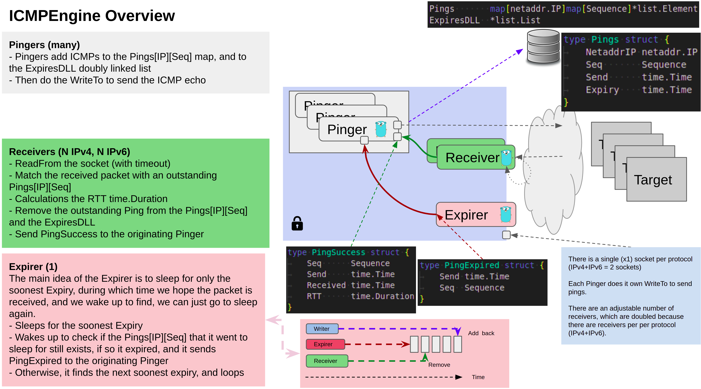

# ICMPEngine

ICMPengine is a small library for sending non-privilged ICMP echo requests and recieving replies.

Key features include:
- Single IPv4 socket, and single IPv6 socket
- Does not wait for timeouts on packets, instead it can proceed to send more
- Single expiry timer
- - Uses double linked list to track the soonest single expiry timer, rather than having many timers
- - Currently because it uses [https://golang.org/pkg/container/list](https://golang.org/pkg/container/list) all the expiry timers need to be the duration ( to allow inserting at the back of the list )
- - ( Should move to [https://golang.org/pkg/container/heap/](https://golang.org/pkg/container/heap/) )
- - ( Currently there is a single Expirer and linked list, but this could be sperated per protocol if required )
- Leverages the native golang [https://golang.org/x/net/icmp](https://golang.org/x/net/icmp) library
- IPPROTO_ICMP sockets which are NonPrivilegedPing [https://lwn.net/Articles/422330/](https://lwn.net/Articles/422330/)
- Uses IP type [https://pkg.go.dev/inet.af/netaddr](https://pkg.go.dev/inet.af/netaddr), see also: [https://tailscale.com/blog/netaddr-new-ip-type-for-go/](https://tailscale.com/blog/netaddr-new-ip-type-for-go/)
- [https://golang.org/pkg/sync/#Pool](https://golang.org/pkg/sync/#Pool) is used for the receive buffers, although this may not be required
- Please note packet size and DSCP bits are NOT currently supported
- Performance testing across a low latency LAN showed ICMPengine can perform at least 60k pings in <15s

Although this is designed to be used as a library, a basic implmentation is demonstrated here:
[./cmd/icmpengine/icmpengine.go](./cmd/icmpengine/icmpengine.go)

```
sudo sysctl -w net.ipv4.ping_group_range="0 2147483647"
```



## Dependency licenses

Dependancy                                                     | License         | Link
---                                                            | ---             | ---
Golang                                                         | BSD             | https://golang.org/LICENSE
github.com/go-cmd/cmd v1.3.0                                   | MIT             | https://github.com/go-cmd/cmd/blob/master/LICENSE
github.com/go-kit/kit v0.10.0                                  | MIT             | https://github.com/go-kit/kit/blob/master/LICENSE
github.com/hashicorp/go-hclog v0.16.2                          | MIT             | https://github.com/hashicorp/go-hclog/blob/master/LICENSE
github.com/pkg/profile v1.6.0                                  | BSD             | https://github.com/pkg/profile/blob/master/LICENSE
github.com/prometheus/client_golang v1.11.0                    | Apache 2.0      | https://github.com/prometheus/client_golang/blob/master/LICENSE
golang.org/x/net v0.0.0-20210726213435-c6fcb2dbf985            | BSD             | https://golang.org/LICENSE
inet.af/netaddr v0.0.0-20210721214506-ce7a8ad02cc1             | BSD-3           | https://pkg.go.dev/inet.af/netaddr?tab=licenses

```
das@das-dell5580:~/go/src/gitlab.edgecastcdn.net/dseddon/icmpengine$ cat go.mod 
module gitlab.edgecastcdn.net/dseddon/icmpengine

go 1.16

require (
	github.com/go-cmd/cmd v1.3.0
	github.com/go-kit/kit v0.10.0 // indirect
	github.com/hashicorp/go-hclog v0.16.2
	github.com/pkg/profile v1.6.0
	github.com/prometheus/client_golang v1.11.0
	golang.org/x/net v0.0.0-20210726213435-c6fcb2dbf985
	inet.af/netaddr v0.0.0-20210721214506-ce7a8ad02cc1
)
```

How to tag
```
git tag
git tag -a v1.0.1 -m "v1.0.1"
git push origin --tags
```